# 神经网络与深度学习 期中作业

小组成员：

1. 林恒旭 21210980049
2. 刘竹君 21210980052

时间：2022年5月10号

Github Repo：[Image-Clssification-And-Object-Detection](https://github.com/KomorebiLHX/Image-Clssification-And-Object-Detection.git)

Model Path (Baidu Drive)：

+ [Faster R-CNN](https://pan.baidu.com/s/11eLZfDzwwr3NPM4zNGXx4g?pwd=rjh3)
+ [Yolov3](https://pan.baidu.com/s/1tmlyrbY8gKXqoVSG4RdtcQ?pwd=lmf9 )

Referenced GitHub Repo：

+ [A simplified implemention of Faster R-CNN that replicate performance from origin paper](https://github.com/chenyuntc/simple-faster-rcnn-pytorch)
+ [ultralytics/yolov3](https://github.com/ultralytics/yolov3)

## Object Detection

### How to RUN

#### Faster R-CNN

1. **install dependencies**

```bash
# create conda env
conda create --name simp python=3.7
conda activate simp
# install pytorch
conda install pytorch torchvision cudatoolkit=10.2 -c pytorch

# install other dependancy
pip install visdom scikit-image tqdm fire ipdb pprint matplotlib torchnet

# start visdom
nohup python -m visdom.server &
```

2. **prepare data**

   1. Download the training, validation, test data and VOCdevkit

      ```Bash
      wget http://host.robots.ox.ac.uk/pascal/VOC/voc2007/VOCtrainval_06-Nov-2007.tar
      wget http://host.robots.ox.ac.uk/pascal/VOC/voc2007/VOCtest_06-Nov-2007.tar
      wget http://host.robots.ox.ac.uk/pascal/VOC/voc2007/VOCdevkit_08-Jun-2007.tar
      ```
   
   2. Extract all of these tars into one directory named `VOCdevkit`
   
       ```Bash
       tar xvf VOCtrainval_06-Nov-2007.tar
       tar xvf VOCtest_06-Nov-2007.tar
       tar xvf VOCdevkit_08-Jun-2007.tar
       ```
   
   3. It should have this basic structure
   
       ```Bash
       $VOCdevkit/                           # development kit
       $VOCdevkit/VOCcode/                   # VOC utility code
       $VOCdevkit/VOC2007                    # image sets, annotations, 		etc.
       # ... and several other directories ...
       ```
   
   4. modify `voc_data_dir` cfg item in `utils/config.py`.


3. **train**

    ```bash
    bash scripts/run.sh
    ```

	you may refer to `utils/config.py` for more argument.

    Some Key arguments:

    - `--caffe-pretrain=False`: use pretrain model from caffe or torchvision (Default: torchvison)
    - `--plot-every=n`: visualize prediction, loss etc every `n` batches.
    - `--env`: visdom env for visualization
    - `--voc_data_dir`: where the VOC data stored
    - `--use-drop`: use dropout in RoI head, default False
    - `--use-Adam`: use Adam instead of SGD, default SGD. (You need set a very low `lr` for Adam)
    - `--load-path`: pretrained model path, default `None`, if it's specified, it would be loaded.

    you may open browser, visit `http://<ip>:8097` and see the visualization of training procedure.

3. **detect**

   Firstly download the model, then move it in to `checkpoints`. Modify`load_path` and `predict_data_dir ` in `detect.ipynb` if you want.

#### Yolov3

1. **install dependencies**

    ```bash
    $ pip install -r requirements.txt
    ```

2. **prepare data**

   Modify `path` in `data/voc.yaml` to customize the data path. If there is no VOC data in `path`, VOC will be downloaded automatically.

3. **train**

   ```bash
   # You can modify parameters in train.sh (e.g. --device)
   bash scripts/train.sh
   ```

4. **detect**

    Firstly download the model, then move it in to `runs/train/exp/weights`. Then
    
    ```bash
    bash detect.sh
    ```

### 作业要求

1. 在VOC数据集上训练并测试目标检测模型Faster R-CNN和YOLO V3；在四张测试图像上可视化Faster R-CNN第一阶段的proposal box；
2. 两个训练好后的模型分别可视化三张不在VOC数据集内，但是包含有VOC中类别物体的图像的检测结果（类别标签，得分，boundingbox），并进行对比，一共show六张图像；

### VOC 数据集介绍

PASCAL VOC挑战赛是一个世界级的计算机视觉挑战赛，[PASCAL](https://link.zhihu.com/?target=http%3A//www.pascal-network.org/)全称：Pattern Analysis, Statical Modeling and Computational Learning，是一个由欧盟资助的网络组织。

很多优秀的计算机视觉模型比如分类，定位，检测，分割，动作识别等模型都是基于PASCAL VOC挑战赛及其数据集上推出的，尤其是一些目标检测模型（比如大名鼎鼎的R-CNN系列，以及后面的YOLO，SSD等）

PASCAL VOC从2005年开始举办挑战赛，每年的内容都有所不同，从最开始的分类，到后面逐渐增加检测，分割，人体布局，动作识别（Object Classification 、Object Detection、Object Segmentation、Human Layout、Action Classification）等内容，数据集的容量以及种类也在不断的增加和改善。该项挑战赛催生出了一大批优秀的计算机视觉模型（尤其是以深度学习技术为主的）。

### 数据集划分

VOC数据集已经为我们划分了trainval以及test。我们使用trainval作为训练集，test作为测试集。

### 网络结构

#### Faster R-CNN

该模型是two-stage的目标检测算法。其大致可以分为四部分：

1. Conv layers。作为一种CNN网络目标检测方法，Faster RCNN首先使用一组基础的conv+relu+pooling层提取image的feature maps。该feature maps被共享用于后续RPN层和全连接层。
2. Region Proposal Networks。RPN网络用于生成region proposals。该层通过softmax判断anchors属于positive或者negative，再利用bounding box regression修正anchors获得精确的proposals。
3. Roi Pooling。该层收集输入的feature maps和proposals，综合这些信息后提取proposal feature maps，送入后续全连接层判定目标类别。
4. Classification。利用proposal feature maps计算proposal的类别，同时再次bounding box regression获得检测框最终的精确位置。

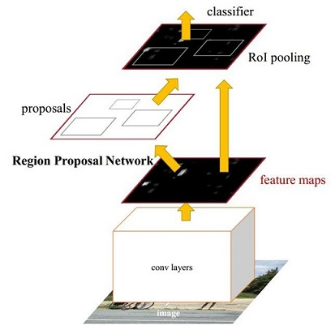

#### Yolov3

YOLO系列算法是一阶段目标检测算法的经典代表，正如其名称“You Only Look Once”所述，其只需要一趟完整的过程即可完成目标的识别和位置定位，能够近乎实时得完成目标检测任务，堪称众多目标检测算法中速度之最。

将特征金字塔与Darknet-53网络模型相结合，就有了Yolov3的主干网络。这里需要说明的是，在整个Yolov3网络中，没有池化层，只有卷积层，通过调节卷积步长控制输出特征图的尺寸。所以对于输入图片尺寸没有特别限制。

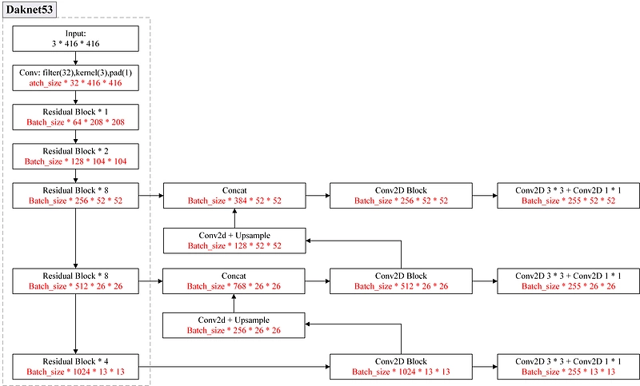

经过上述主干网络后，将输出以下三种不同大小的特征图：

* 13×13×75
* 26×26×75
* 52×52×75

对于这三种网格划分，Yolov3分别提出了三种先验框，先验框的长宽是在建模前使用k-means对数据集中的标签框进行聚类，得到类别中心点的9个框，作为先验框。输出时，每个网格会输出三个部分：每个先验框的位置信息、该像素点是否是物体的置信度、每个类别物体是否存在的置信度。

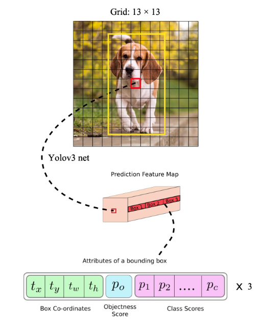

### 实验设置

#### Faster R-CNN

+ batch size: 1
+ learning rate：0.001 (weight_decay=0.0005)
+ 优化器：SGD
+ iteration：70154 (5011 steps per epoch)
+ epoch：14 
+ loss function：total loss分为以下几个部分
  + rpn_loc_loss：一阶段检测框回归误差，形式为smooth l1 loss
  + rpn_cls_loss：一阶段检测框分类误差（是否为物体），形式为cross entropy loss
  + roi_loc_loss：二阶段检测框回归误差，形式为smooth l1 loss
  + roi_cls_loss：二阶段检测框分类误差（是否为某一类别），形式为cross entropy loss
+ 评价指标：mAP（mean Average Precision）

#### Yolov3

+ batch size: 16

+ learning rate：0.01

+ 优化器：SGD

+ iteration：94200 (314 steps per epoch)

+ epoch：300 (early stopping=100, stopped at epoch 260)

+ loss function：total loss分为以下几个部分

  + lbox：检测框回归误差，形式为1 - GIOU

  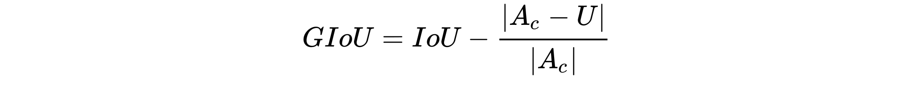

  + lcls：检测框分类误差（是否为某一类别），形式为BCEWithLogitsLoss
  + lobj：检测框分类误差（检测框是否含有物体），形式为BCEWithLogitsLoss
    + 正样本选取规则：如果Ground Truth的中心点落在一个区域中，该区域就负责检测该物体。将与该物体有最大IoU的预测框作为**正样本**
    + 负样本选取规则：如果一个预测框与所有的Ground Truth的最大IoU<ignore_thresh时，那这个预测框就是**负样本**

+ 评价指标：mAP（mean Average Precision），mAP_0.5:0.95

  + mAP_0.5:0.95指的是不同IoU（从0.5到0.95，步长0.05）上的平均mAP
  + 随着IoU阈值升高，精度不断降低，召回不断升高

#### 可视化

##### 在四张测试图像上可视化Faster R-CNN第一阶段的proposal box

开源代码中并没有可视化第一阶段的proposal box，因此我们添加了可视化第一阶段的proposal box函数```one_stage_predict```。(详见```train.py```以及```model/faster_rcnn.py```)。简单来说，我们只取用rpn的输出rois，而抛弃修正信息roi_cls_loc。这些图片被输出在visdom中（在训练中可以看到）。

为了比较第一阶段的proposal box与最终输出的proposal box的区别，我们一共可视化八张图片，分别对应第一阶段和最终输出。

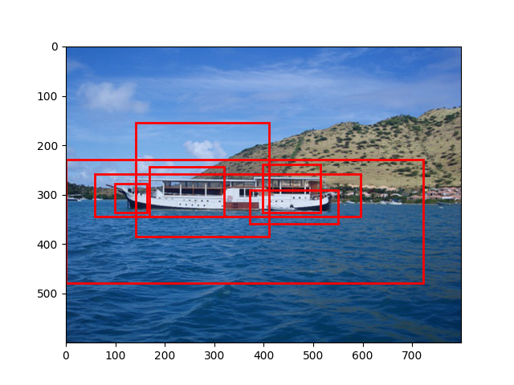

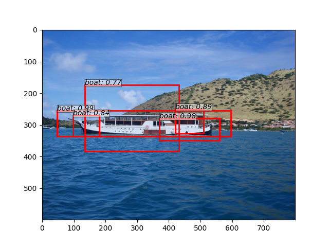

.jpg)

.jpg)

.jpg)

.jpg)


.jpg)

.jpg)

可以看到，第一阶段的proposal box只**经过了一次坐标修正**，没有很好地定位目标的位置，并且也没有进行类别分类，因此没有类别的信息。此外，第一阶段的proposal box没有经过 non-maximum suppression (NMS)，所以有一些重叠的检测框没有被删减，导致了检测框比较错乱地分布在检测物体的附近。

##### **利用Tensorboard**可视化训练和测试的loss曲线、测试mAP/Acc/mIoU 曲线

1. Faster R-CNN (mAP=69.28)

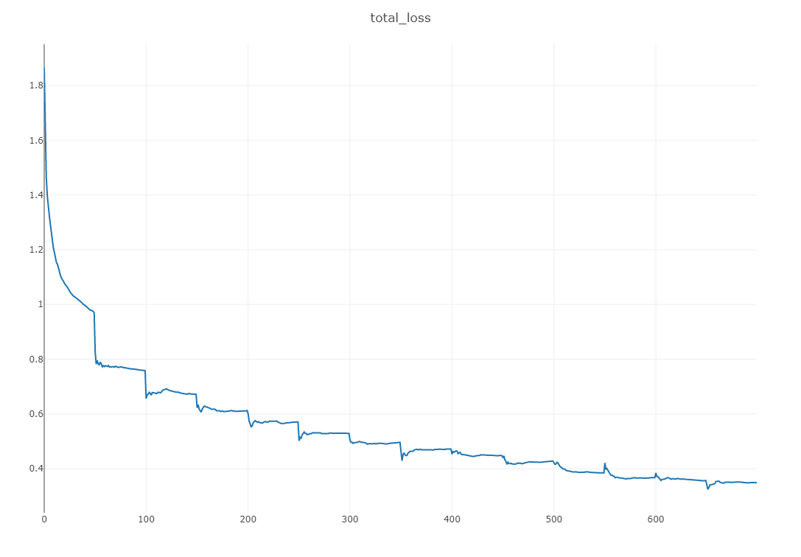

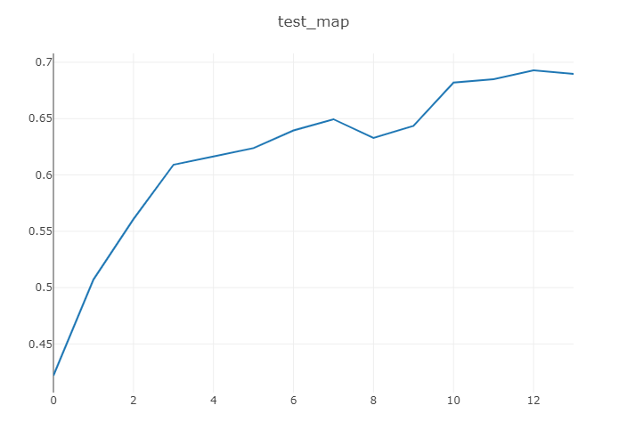

2. Yolov3 (mAP=79.229)

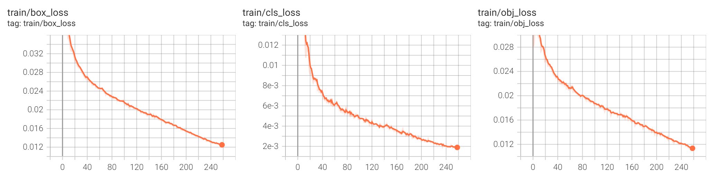


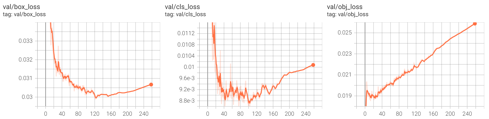

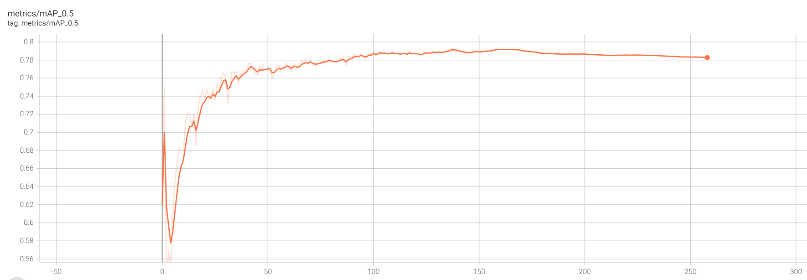

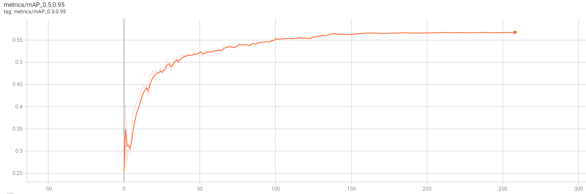

##### 分别可视化三张不在VOC数据集内，但是包含有VOC中类别物体的图像的检测结果

图片位于`datasets/demo/images`

1. Faster R-CNN

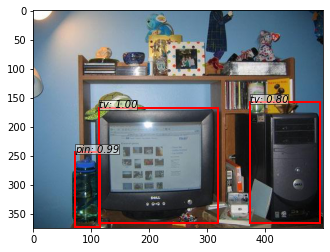

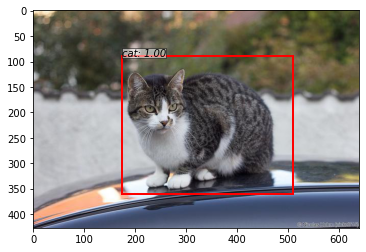

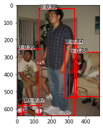


2. Yolov3

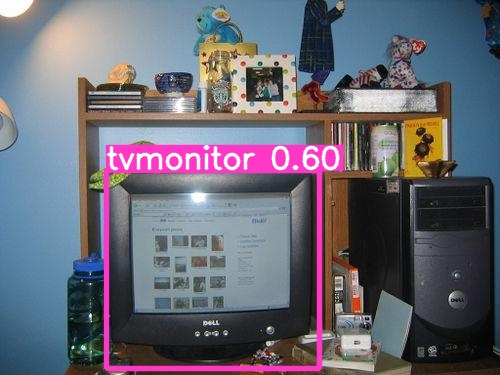

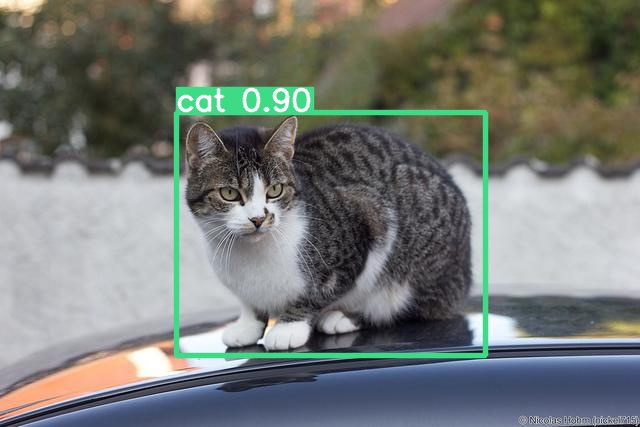

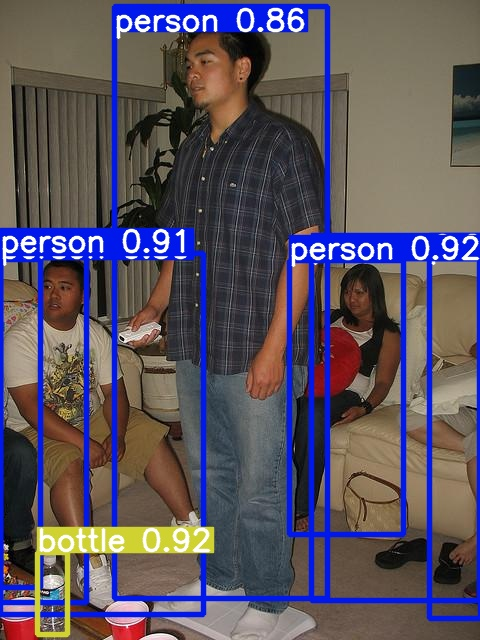

第一张图中，Faster R-CNN错误地把电脑主机检测成了显示屏，但是检测出了bottle。Yolov3则没有检测出bottle。

第二张图两个模型都准确地检测出了猫。

第三张图中，Faster R-CNN和Yolov3都检测到了图中的四个人，但是Faster R-CNN的检测框定位相对不准。

综合来看，Yolov3较Faster R-CNN的检测能力更强，检测框定位更准，且分类也更准。
